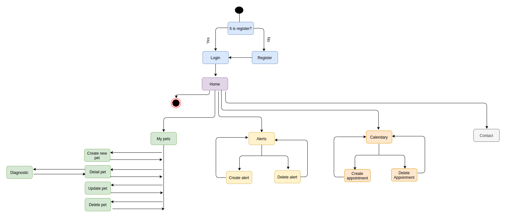

# PET-CARE

## INTRODUCTION
The application allows pet owners to keep track of all their pets, being able to consult the history of the pet, create alerts so that they know when they have some type of medication or consult the vet, as well as being able to create alerts through a calendar .

## FUNCTIONAL DESCRIPTION
### Use Cases

### Work Flow
   

## TECHNICAL DESCRIPTION
### Blocks
   

### API coverage
 

### Data Model

## Technologies
JavaScript, ReactJS, Node.js, Express, MongoDB, Mongoose, SASS & BEM. Testing: Jest & Mocha/Chai

## TO DO
Improve inputs

- Add rol of veterinary
- Work more in the schedule
- Add chat with veterinary
